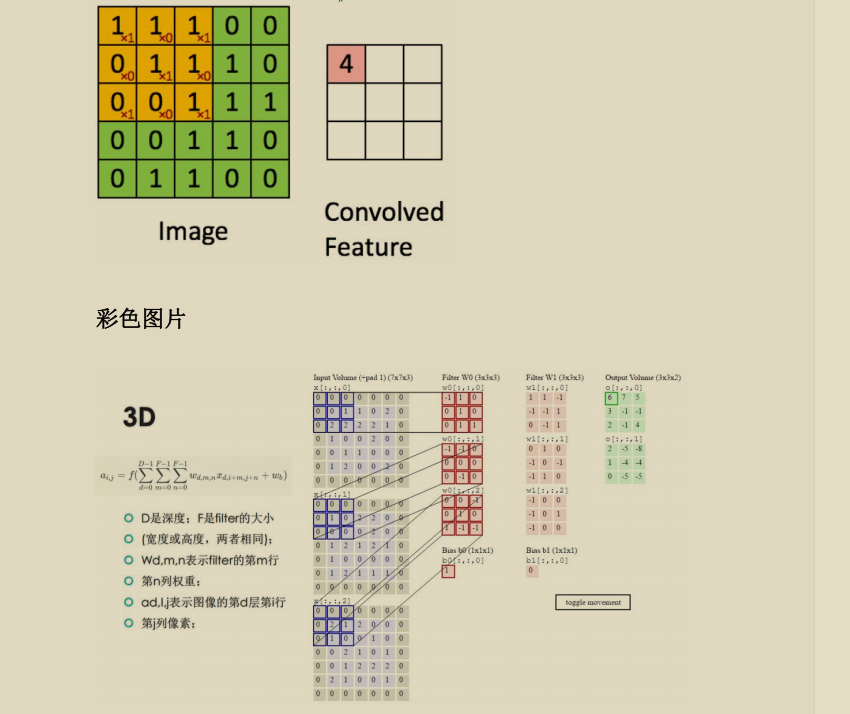

## 卷积神经网络（Convolutional Neunal Network）

1. 感受野：一个神经元在输入图像上能够“看到”的区域，决定了该神经元能够提取的特征信息量。感受野的大小受卷积核大小、步长、池化层等因素的影响
   作用：
   小感受野（局部特征提取）：适合捕捉边缘、纹理等低级特征
   大感受野（全局信息）：有助于理解整体结构，比如语义信息或全局形状
2. 卷积计算：输入h*w*c(图像数据：高x宽x颜色通道)的数据，利用卷积核进行特征提取，最后生成一个feature Map,一个卷积核生成一个featureMap
   对每一个通道卷积区域与卷积核进行相乘相加得到一个新的特征值
3. 权值共享：对于同一个feature Map,使用的是相同的卷积核（权值）进行输入特征的处理。
   优点：
      - 大幅减少参数数量
      - 提升模型的泛化能力
4. padding（边界填充）:给输入的边缘填充一圈或多圈像素（值为0的元素）,用于控制输入特征图的宽高和避免信息丢失，也能防止边界数据和其他数据利用率相同。padding的两种模式：
   - valid模式：不进行任何填充，直接进行卷积操作，卷积后生成的特征图较原输入特征图会更小
   - same模式：填充输入，使得输出和输入的特征图的宽高相同
5. 池化（pooling）:目标是降采样，减少计算量、内存使用、参数数量（可以防止过拟合）。对于给定长宽及步长的池化核，对于输入特征图进行处理，在一个
   池化核中取一个像素（如取最大或取均值），相当于对特征图进行压缩处理。
6. CNN架构
   - 卷积神经网络的基本架构：卷积神经网络的核心是获得特征图。先进行卷积操作，然后对卷积结果进行非线性变换（如Relu）,然后进行池化操作减小特征图的
      规模；接着在使用全连接层进行整合前把特征图转换为特征向量（卷积神经网络得到的特征图是一个三维的立体的，而全连接层是使用权重参数矩阵计算的，所以需要全连接层的输入
      也是个矩阵（1*n的向量）），最后同DNN一样处理输入。
